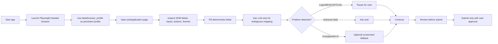

# Auto Job Apply POC — Local AI Development Instructions

## 0. Purpose

Build a **local-first proof of concept** for an app named **Auto Job Apply**.

The app helps a user apply to jobs by using their resume, target role, user-provided LLM API key, and reusable application answers. The POC should prioritize reliability, human review, local storage, and safe automation over full autonomy.

The POC should run locally and should not require an external database, hosted backend, or cloud worker.

---

## 1. Product Scope

### 1.1 User Inputs

The app should accept:

- Resume file, preferably PDF or DOCX.
- Target job title, for example `Software Engineer II`.
- User-provided LLM API key, for example OpenAI-compatible API key.
- Email address, either parsed from resume or manually provided.
- Reusable application answers, including but not limited to:
  - Work authorization.
  - Sponsorship requirement.
  - Veteran status.
  - Race / ethnicity.
  - Disability status.
  - Gender, where applicable.
  - Salary expectation.
  - Relocation willingness.
  - Remote / hybrid / onsite preference.
- Number of applications the user wants to complete.
- Optional company seed list or job source list.

### 1.2 POC Responsibilities

The app should:

1. Parse the resume into a structured local profile.
2. Ask the user for missing global information.
3. Search for jobs matching the target title.
4. Open a visible Chrome/Chromium browser using Playwright.
5. Fill job application forms when fields are known.
6. Generate cover letters only when needed or explicitly requested.
7. Pause for user input when login, account creation, CAPTCHA, MFA, unknown questions, or risky questions appear.
8. Record discovered jobs, attempted jobs, skipped jobs, submitted jobs, failures, screenshots, and important events in local files.
9. Stop once the requested number of successful applications has been reached.
10. Produce a final local report.

### 1.3 POC Non-Goals

Do **not** implement the following in the first POC:

- No external database.
- No hosted backend.
- No cloud worker.
- No fully autonomous account creation.
- No CAPTCHA bypass.
- No MFA bypass.
- No scraping of websites that prohibit automated access.
- No automatic submission without explicit user approval.
- No guessing sensitive demographic information.
- No storing API keys in logs or plaintext configuration files.
- No use of the user's everyday browser profile by default.

The POC should be an **autofill + user-approved submit** tool, not a spammy mass-apply bot.

---

## 2. Recommended Technical Stack

### 2.1 Minimum Stack

Use:

```txt
Python
Playwright
Local JSON / JSONL files
OpenAI-compatible LLM API client
PDF/DOCX parsing libraries
CLI first, optional Streamlit UI later
```

Recommended packages:

```txt
playwright
pydantic
python-dotenv
openai or another OpenAI-compatible client
pypdf or pdfplumber
python-docx
typer or click
rich
```

Optional packages:

```txt
streamlit
rapidfuzz
beautifulsoup4
requests
pyautogui
pillow
```

### 2.2 Preferred Architecture

Use Playwright as the main browser automation engine.

The app should launch a **visible headed Chromium/Chrome browser** with a dedicated persistent browser profile:

```txt
data/browser_profile/
```

The user should be able to watch the browser work and intervene manually.

Use screenshot-based automation only as a fallback, not as the primary automation method.

### 2.3 No Database Requirement

Do not use SQLite, Postgres, MongoDB, or any external database for the POC.

Use local files:

```txt
JSON      for current state
JSONL     for append-only event and application logs
PNG/JPG   for screenshots
TXT/MD    for generated reports
PDF/DOCX  for resumes and generated cover letters, where applicable
```

---

## 3. Overall Structure

Create the project with the following structure:

```txt
auto-job-apply/
  README.md
  pyproject.toml
  .gitignore
  .env.example

  auto_job_apply/
    __init__.py
    main.py

    config.py
    constants.py
    errors.py
    logging_setup.py

    models/
      __init__.py
      profile.py
      job.py
      application.py
      answers.py
      events.py
      llm.py

    storage/
      __init__.py
      paths.py
      json_store.py
      jsonl_store.py
      artifact_store.py
      report_writer.py

    resume/
      __init__.py
      parser.py
      extractor.py
      normalizer.py

    llm/
      __init__.py
      client.py
      prompts.py
      structured_outputs.py
      cover_letter.py
      form_mapping.py

    jobs/
      __init__.py
      discovery.py
      normalizer.py
      matcher.py
      dedupe.py
      sources/
        __init__.py
        manual.py
        greenhouse.py
        lever.py
        ashby.py
        search_engine.py

    browser/
      __init__.py
      launcher.py
      session.py
      page_utils.py
      screenshots.py
      human_pause.py

    apply/
      __init__.py
      runner.py
      form_reader.py
      form_filler.py
      field_mapper.py
      submission.py
      adapters/
        __init__.py
        generic.py
        greenhouse.py
        lever.py
        ashby.py

    ui/
      __init__.py
      cli.py
      streamlit_app.py

    safety/
      __init__.py
      secrets.py
      pii.py
      validation.py
      policy.py

  data/
    .gitkeep
    resumes/
    cover_letters/
    screenshots/
    browser_profile/
    reports/

  tests/
    test_resume_parser.py
    test_answer_bank.py
    test_job_dedupe.py
    test_field_mapper.py
    test_jsonl_store.py
```

### 3.1 Data Directory Structure

Runtime data should live under a local `data/` directory:

```txt
data/
  profile.json
  answer_bank.json
  settings.json
  jobs.discovered.jsonl
  jobs.filtered.jsonl
  applications.jsonl
  events.jsonl
  resumes/
  cover_letters/
  screenshots/
  browser_profile/
  reports/
```

### 3.2 File Responsibilities

#### `profile.json`

Stores normalized resume/profile data:

```json
{
  "name": "Jane Doe",
  "first_name": "Jane",
  "last_name": "Doe",
  "email": "jane@example.com",
  "phone": "+1...",
  "location": "San Francisco, CA",
  "linkedin": "https://linkedin.com/in/janedoe",
  "github": "https://github.com/janedoe",
  "portfolio": "https://janedoe.dev",
  "skills": ["Python", "React", "AWS"],
  "years_experience": 5,
  "education": [],
  "experience": []
}
```

#### `answer_bank.json`

Stores user-approved reusable answers:

```json
{
  "needs_sponsorship": {
    "value": false,
    "sensitive": false,
    "user_approved_reuse": true
  },
  "work_authorization": {
    "value": "Authorized to work in the United States",
    "sensitive": false,
    "user_approved_reuse": true
  },
  "veteran_status": {
    "value": "I do not wish to answer",
    "sensitive": true,
    "user_approved_reuse": true
  },
  "race_ethnicity": {
    "value": "I do not wish to answer",
    "sensitive": true,
    "user_approved_reuse": true
  },
  "disability_status": {
    "value": "I do not wish to answer",
    "sensitive": true,
    "user_approved_reuse": true
  }
}
```

#### `jobs.discovered.jsonl`

Append one job per line:

```json
{"ts":"2026-06-03T12:00:00Z","source":"greenhouse","company":"Acme","title":"Software Engineer II","location":"Remote","url":"https://...","apply_url":"https://...","status":"discovered"}
```

#### `applications.jsonl`

Append one application attempt per line:

```json
{"ts":"2026-06-03T12:05:00Z","company":"Acme","title":"Software Engineer II","url":"https://...","status":"submitted","screenshot":"data/screenshots/acme-confirmation.png"}
```

#### `events.jsonl`

Append detailed operational logs:

```json
{"ts":"2026-06-03T12:04:11Z","level":"info","event":"field_filled","field":"email","source":"profile.email","confidence":1.0}
```

Do not log secrets, full API keys, passwords, cookies, access tokens, or sensitive demographic values unless the user explicitly chooses to save them and they are necessary for functionality.

---

## 4. Main Flow Chart

```mermaid
flowchart TD
    A[User opens Auto Job Apply app] --> B[Upload resume]
    B --> C[Extract resume text]
    C --> D[Create structured profile JSON]
    D --> E{Missing required profile fields?}

    E -- Yes --> F[Ask user for missing global info]
    F --> G[Save profile.json and answer_bank.json]
    E -- No --> G

    G --> H[User enters target title, max applications, preferences, API key]
    H --> I[Launch visible Chrome/Chromium with dedicated persistent profile]
    I --> J[Discover jobs from supported sources]

    J --> K[Normalize job records]
    K --> L[Deduplicate jobs using URL, company/title, and description hash]
    L --> M[Filter and rank jobs]

    M --> N{Successful application count reached?}
    N -- Yes --> Z[Write final report]
    N -- No --> O[Open next application URL]

    O --> P{Login, account creation, CAPTCHA, MFA, or blocked page?}
    P -- Yes --> Q[Pause and ask user to complete manually]
    Q --> R[Resume automation after user confirmation]
    P -- No --> R

    R --> S[Read visible form fields from DOM]
    S --> T[Map fields to profile and answer bank]
    T --> U{Unknown, risky, or low-confidence field?}

    U -- Yes --> V[Ask user for answer]
    V --> W{User approves saving answer for reuse?}
    W -- Yes --> X[Update answer_bank.json]
    W -- No --> Y[Use answer once only]
    X --> AA[Fill known fields]
    Y --> AA

    U -- No --> AA
    AA --> AB{Cover letter required?}
    AB -- Yes --> AC[Generate claim-safe cover letter]
    AC --> AD[Attach cover letter]
    AB -- No --> AE[Skip cover letter]

    AD --> AF[Attach resume]
    AE --> AF

    AF --> AG[Take pre-submit screenshot]
    AG --> AH[Ask user to review]
    AH --> AI{User approves submit?}

    AI -- Yes --> AJ[Submit application]
    AI -- No --> AK[Mark skipped or needs review]

    AJ --> AL[Capture confirmation or result]
    AK --> AM[Append result to applications.jsonl]
    AL --> AM
    AM --> N
```



---

## 5. Browser Automation Flow



---

## 6. Implementation Phases for the POC

### Phase 0 — Project Bootstrap

Deliver:

- Python project scaffold.
- `.gitignore` that excludes local data and secrets.
- `.env.example` with placeholder variables only.
- Basic CLI command.
- Local `data/` directory creation.
- JSON and JSONL storage helpers.
- Event logging helper that redacts secrets.

Definition of done:

- Running the CLI creates the expected local directories.
- The app does not crash when `data/` does not exist.
- No secret or personal runtime data is committed.

Suggested command:

```bash
python -m auto_job_apply.main init
```

---

### Phase 1 — Resume Intake and Profile Builder

Deliver:

- Resume upload/path input.
- PDF text extraction.
- DOCX text extraction.
- Resume text cleanup.
- Structured profile extraction.
- Manual correction flow.
- Save to `data/profile.json`.

Implementation approach:

1. Extract raw text using deterministic parsers.
2. Use regex for obvious fields:
   - Email.
   - Phone.
   - LinkedIn.
   - GitHub.
   - Portfolio URL.
3. Use the LLM for structured extraction of harder fields:
   - Skills.
   - Work experience.
   - Education.
   - Years of experience.
4. Validate the result with Pydantic.
5. Ask the user to confirm or edit uncertain fields.

Definition of done:

- Given a resume, the app writes `profile.json`.
- The user can manually override extracted values.
- The app does not invent experience or credentials.
- The app flags uncertain data instead of pretending it is certain.

---

### Phase 2 — Answer Bank

Deliver:

- Local `answer_bank.json`.
- CLI prompts for common reusable answers.
- Explicit handling of sensitive demographic answers.
- Reuse approval flag per answer.

Required behavior:

- Never infer race, ethnicity, gender, disability, veteran status, or immigration status from the resume.
- Ask the user explicitly.
- Always allow `I do not wish to answer` when available.
- Store whether the answer is sensitive.
- Store whether the user approved reuse.

Definition of done:

- The app can answer common form questions from `answer_bank.json`.
- Sensitive fields are not guessed.
- Sensitive answers are not printed in normal logs.

---

### Phase 3 — Job Discovery

Deliver:

- Manual job URL input.
- Optional company seed list.
- Supported source adapters, starting with structured ATS sources.
- Normalize discovered jobs to a common schema.
- Append discovered jobs to `jobs.discovered.jsonl`.

Recommended source order:

1. Manual job URLs.
2. Company seed list.
3. Greenhouse-style job boards.
4. Lever-style job boards.
5. Ashby-style job boards.
6. Search API, only if permitted and configured.

Avoid:

- Aggressive scraping.
- Bypassing robots, rate limits, or access controls.
- Scraping sites that explicitly prohibit automated access.

Definition of done:

- The app can discover or accept a list of jobs.
- Each job has a normalized structure:

```json
{
  "source": "manual",
  "company": "ExampleCo",
  "title": "Software Engineer II",
  "location": "Remote",
  "url": "https://example.com/job",
  "apply_url": "https://example.com/apply",
  "description": "..."
}
```

---

### Phase 4 — Job Matching, Filtering, and Deduplication

Deliver:

- Target title matching.
- Location filtering.
- Remote/hybrid/onsite filtering.
- Basic seniority matching.
- Duplicate detection.
- Append filtered jobs to `jobs.filtered.jsonl`.

Deduplication keys:

- Exact application URL.
- Canonicalized job URL.
- Company + title + location.
- Optional description hash.

Filtering should support:

```txt
target_title
excluded_keywords
required_keywords
locations
remote_only
minimum_match_score
```

Definition of done:

- The same job is not applied to twice.
- Low-match jobs are skipped and logged with reasons.
- The app can produce a ranked queue of jobs to attempt.

---

### Phase 5 — Browser Launch and Session Management

Deliver:

- Playwright browser launcher.
- Headed browser mode by default.
- Dedicated persistent browser profile at `data/browser_profile/`.
- Manual pause/resume function.
- Screenshot helper.

Required behavior:

- The user can watch the browser.
- The app pauses for login, MFA, CAPTCHA, account creation, or blocked pages.
- The app never attempts to bypass CAPTCHA or MFA.
- The app never stores the user's normal browser cookies by default.

Definition of done:

- The app can open a visible browser.
- The app can open a job URL.
- The user can manually intervene.
- The app can resume after user confirmation.

---

### Phase 6 — Form Reading and Field Mapping

Deliver:

- DOM form reader.
- Field label extraction.
- Required field detection where possible.
- Common field mapper.
- LLM-assisted fallback for ambiguous fields.
- Confidence score per field mapping.

Common deterministic mappings:

```txt
First Name             -> profile.first_name
Last Name              -> profile.last_name
Email                  -> profile.email
Phone                  -> profile.phone
LinkedIn               -> profile.linkedin
GitHub                 -> profile.github
Portfolio              -> profile.portfolio
Current Location       -> profile.location
Resume                 -> resume file upload
Require sponsorship?   -> answer_bank.needs_sponsorship
Work authorization     -> answer_bank.work_authorization
```

LLM mapping rules:

- Use LLM only when deterministic mapping fails or is ambiguous.
- Request structured JSON output.
- Require a confidence score.
- Do not fill if confidence is below the threshold.
- Do not guess sensitive answers.
- Save the mapping decision to `events.jsonl` without leaking sensitive values.

Definition of done:

- The app can read a form and identify common fields.
- The app fills high-confidence fields.
- The app pauses for unknown fields.

---

### Phase 7 — Application Filling

Deliver:

- Fill text inputs.
- Select radio buttons.
- Select dropdown options.
- Check checkboxes only when safe and explicit.
- Upload resume.
- Upload cover letter when available and required.
- Scroll through multi-step forms.
- Save pre-submit screenshots.

Required behavior:

- Never click final submit without user approval.
- Never accept legal agreements, background-check authorizations, or certifications unless the user explicitly approves.
- Do not falsely certify facts on behalf of the user.
- If a required field is unknown, pause.

Definition of done:

- The app can fill a simple application form.
- The app can handle required missing fields by asking the user.
- The app can save a screenshot before submission.

---

### Phase 8 — Cover Letter Generation

Deliver:

- Cover letter generator.
- Claim-safety guardrails.
- Save generated letters to `data/cover_letters/`.
- User review before upload.

Cover letter rules:

- Do not invent experience.
- Do not claim skills not present in the resume/profile unless the user confirms them.
- Keep letters concise.
- Mention company and role.
- Tie only verified user experience to job requirements.
- If the job does not require a cover letter, skip by default.

Definition of done:

- The app can generate a short cover letter for a job.
- The user can review/edit it.
- The generated file is saved locally.

---

### Phase 9 — User Review and Submission

Deliver:

- Pre-submit review pause.
- User options:
  - Submit.
  - Skip.
  - Edit manually then continue.
  - Mark as needs review.
- Confirmation capture after submission.
- Append application result to `applications.jsonl`.

Required behavior:

- The default mode is user-approved submission.
- If the app cannot detect success or failure, mark status as `unknown_needs_review`.
- Capture screenshot after submit when possible.

Application statuses:

```txt
discovered
matched
skipped_duplicate
skipped_low_match
opened
needs_login
needs_account
needs_user
ready_for_review
submitted
failed
user_skipped
unknown_needs_review
```

Definition of done:

- The app records every attempted application.
- Successful submissions are counted toward the requested application count.
- Skipped and failed applications are not counted as successful submissions.

---

### Phase 10 — Stop Condition and Final Report

Deliver:

- Stop when successful submitted count reaches the user's requested number.
- Stop when no eligible jobs remain.
- Stop when the user cancels.
- Generate local Markdown report.

Report should include:

```txt
Target title
Requested applications
Successful submissions
Skipped jobs
Failed attempts
Needs-user jobs
Company/title/url/status table
Screenshots location
Cover letters location
Timestamp
```

Definition of done:

- The app stops correctly.
- The final report is saved under `data/reports/`.
- The report does not include secrets.

---

## 7. Security and Safety Instructions for the AI Coding Agent

Follow these instructions strictly.

### 7.1 General Security Requirements

Deliver code without known security vulnerabilities.

The implementation must:

- Validate all file paths.
- Prevent path traversal.
- Avoid unsafe deserialization.
- Avoid shell injection.
- Avoid logging secrets.
- Avoid storing plaintext API keys unless explicitly required by the user.
- Avoid using `eval`, `exec`, or dynamic code execution.
- Avoid hardcoded credentials.
- Avoid committing local user data.
- Avoid sending resume or personal data to any third party except the configured LLM provider and only for required tasks.
- Use least privilege for browser automation and file access.
- Redact secrets from logs and error messages.

### 7.2 Secrets Handling

API keys should be handled in this order of preference:

1. Runtime prompt input.
2. Environment variable.
3. `.env` file excluded from git.
4. OS keychain in a later version.

Never write the full API key to:

- `events.jsonl`
- `applications.jsonl`
- reports
- screenshots metadata
- error traces
- console output

When displaying a key for debugging, mask it:

```txt
sk-...abcd
```

### 7.3 PII Handling

The app processes sensitive personal information. Treat all resume data, profile data, demographic answers, application answers, and screenshots as private.

Requirements:

- Keep all data local by default.
- Do not upload screenshots to remote services unless explicitly requested.
- Do not include sensitive values in normal logs.
- Provide a simple way to delete local data.
- Put `data/` in `.gitignore`.

Suggested `.gitignore` entries:

```gitignore
.env
.env.*
!.env.example
/data/*
!data/.gitkeep
*.log
__pycache__/
.pytest_cache/
.venv/
```

### 7.4 Browser Security

Use a dedicated browser profile:

```txt
data/browser_profile/
```

Do not use the user's main Chrome profile by default.

Do not store passwords directly in app files.

Pause for:

- Login.
- MFA.
- CAPTCHA.
- Account creation.
- Email verification.
- Legal certification.
- Any page that asks the user to prove identity.

### 7.5 Compliance and Site Respect

The app must not:

- Bypass access controls.
- Bypass anti-bot systems.
- Bypass CAPTCHA or MFA.
- Ignore rate limits.
- Scrape websites that prohibit automated access.
- Create fake accounts.
- Submit false information.
- Submit applications without user approval in the POC.

When in doubt, pause and ask the user.

### 7.6 Sensitive Demographic Answers

The app must never infer or guess:

- Race.
- Ethnicity.
- Gender.
- Disability.
- Veteran status.
- Immigration status.
- Citizenship.
- Age.
- Religion.
- Sexual orientation.

Only use explicit user-provided answers.

If a field is optional and the user has not provided an answer, prefer:

```txt
I do not wish to answer
Decline to self-identify
Prefer not to say
```

depending on the available option text.

### 7.7 LLM Safety Requirements

LLM usage must be constrained.

For resume extraction:

- Ask the LLM to extract only facts present in the resume.
- Do not allow the LLM to invent experience, skills, credentials, or dates.
- Validate output with Pydantic.

For field mapping:

- Ask for structured JSON output.
- Require confidence scores.
- Do not fill low-confidence answers.
- Do not guess sensitive fields.

For cover letters:

- Generate only claim-safe text.
- Use only verified facts from the resume/profile.
- Keep a list of claims used.
- Let the user review before upload.

### 7.8 Error Handling

Do not hide errors.

Each operation should return a clear status:

```txt
success
skipped
needs_user
failed
unknown_needs_review
```

On failure, log:

- Timestamp.
- Company.
- Job title.
- URL.
- Step name.
- Error type.
- Redacted error message.
- Screenshot path when available.

Do not log:

- API keys.
- Passwords.
- Cookies.
- Session tokens.
- Full sensitive demographic answers.

---

## 8. Core Data Models

Use Pydantic models or equivalent validation.

### 8.1 Profile

```python
class Profile(BaseModel):
    first_name: str | None = None
    last_name: str | None = None
    full_name: str | None = None
    email: str | None = None
    phone: str | None = None
    location: str | None = None
    linkedin: str | None = None
    github: str | None = None
    portfolio: str | None = None
    skills: list[str] = []
    years_experience: float | None = None
    education: list[dict] = []
    experience: list[dict] = []
```

### 8.2 Answer Bank Entry

```python
class AnswerEntry(BaseModel):
    value: str | bool | int | float | None
    sensitive: bool = False
    user_approved_reuse: bool = False
    updated_at: str | None = None
```

### 8.3 Job

```python
class Job(BaseModel):
    source: str
    company: str | None = None
    title: str
    location: str | None = None
    url: str
    apply_url: str | None = None
    description: str | None = None
    discovered_at: str | None = None
    match_score: float | None = None
    status: str = "discovered"
```

### 8.4 Application Attempt

```python
class ApplicationAttempt(BaseModel):
    ts: str
    company: str | None
    title: str
    url: str
    status: str
    resume_path: str | None = None
    cover_letter_path: str | None = None
    screenshot_path: str | None = None
    reason: str | None = None
    confirmation_text: str | None = None
```

### 8.5 Field Mapping

```python
class FieldMapping(BaseModel):
    field_label: str
    field_type: str | None = None
    mapped_key: str | None = None
    answer: str | bool | int | float | None = None
    confidence: float
    source: str | None = None
    requires_user_review: bool = False
    sensitive: bool = False
```

---

## 9. CLI Commands

The POC can start as a CLI.

Suggested commands:

```bash
python -m auto_job_apply.main init
python -m auto_job_apply.main profile --resume ./resume.pdf
python -m auto_job_apply.main answers
python -m auto_job_apply.main discover --title "Software Engineer II" --companies ./companies.txt
python -m auto_job_apply.main apply --title "Software Engineer II" --max-applications 10
python -m auto_job_apply.main report
python -m auto_job_apply.main clear-data
```

### 9.1 Example POC Run

```bash
python -m auto_job_apply.main init
python -m auto_job_apply.main profile --resume ./data/resumes/resume.pdf
python -m auto_job_apply.main answers
python -m auto_job_apply.main discover --title "Software Engineer II" --companies ./companies.txt
python -m auto_job_apply.main apply --title "Software Engineer II" --max-applications 5
python -m auto_job_apply.main report
```

---

## 10. Browser Implementation Notes

### 10.1 Main Mode: App Launches Browser

Use Playwright persistent context:

```python
context = playwright.chromium.launch_persistent_context(
    user_data_dir="data/browser_profile",
    headless=False,
)
page = context.new_page()
```

Requirements:

- `headless=False` by default.
- Use a dedicated profile.
- Let the user manually interact with the page.
- Provide a CLI prompt such as:

```txt
Manual action required. Complete login/CAPTCHA/account step in the browser, then press Enter to continue.
```

### 10.2 Later Mode: Attach to Existing Chrome

This can be added later.

The user must start Chrome with remote debugging enabled and a dedicated user data directory. This is optional and should not be the first implementation path.

Example concept:

```python
browser = playwright.chromium.connect_over_cdp("http://localhost:9222")
```

Do not require this for the POC.

### 10.3 Screenshot Fallback

Screenshot fallback may be added for unsupported pages.

Use it only when:

- The DOM reader fails.
- A custom widget is visually obvious but structurally hard to inspect.
- The app needs debugging evidence.

Do not make screenshot-based automation the default.

---

## 11. Field Mapping Strategy

Use a three-level strategy.

### Level 1 — Deterministic Mapping

Use normalized labels and aliases.

Examples:

```txt
first name, given name              -> profile.first_name
last name, family name, surname     -> profile.last_name
email, email address                -> profile.email
phone, mobile, telephone            -> profile.phone
linkedin, linkedin profile          -> profile.linkedin
github, github profile              -> profile.github
website, portfolio                  -> profile.portfolio
resume, cv                          -> resume file upload
cover letter                        -> generated cover letter file
```

### Level 2 — LLM-Assisted Mapping

If deterministic mapping fails, ask the LLM for a structured mapping.

LLM input should include:

- Field label.
- Field type.
- Available options.
- Profile keys, not necessarily all raw profile content.
- Answer bank keys.
- Whether the field appears required.

LLM output must include:

```json
{
  "mapped_key": "answer_bank.needs_sponsorship",
  "answer": false,
  "confidence": 0.97,
  "requires_user_review": false,
  "reason": "The field asks whether the applicant requires visa sponsorship."
}
```

### Level 3 — Human Input

If the mapping is low-confidence, sensitive, legal, or ambiguous, ask the user.

Save answer for reuse only if the user approves.

---

## 12. Cover Letter Strategy

Generate cover letters only when:

- The form requires a cover letter.
- The user requests one.
- The job appears highly matched and the user enables optional cover letters.

Prompt requirements:

- Use only verified profile facts.
- Match job requirements to user skills.
- Do not invent metrics, employment history, education, credentials, or projects.
- Keep it concise.
- Avoid exaggerated claims.

Save output:

```txt
data/cover_letters/{company_slug}_{title_slug}_{date}.md
```

Optional later export:

```txt
data/cover_letters/{company_slug}_{title_slug}_{date}.pdf
```

---

## 13. Application Recording

Every job attempt must be recorded.

Append to `applications.jsonl` with status.

Example statuses:

```txt
submitted
needs_login
needs_account
needs_user
user_skipped
failed
unknown_needs_review
```

An application counts toward the user's requested number only when status is:

```txt
submitted
```

Do not count:

```txt
failed
skipped
needs_user
unknown_needs_review
```

---

## 14. Report Format

Generate a Markdown report:

```md
# Auto Job Apply Report

Target title: Software Engineer II
Requested submissions: 10
Successful submissions: 7
Skipped: 12
Failed: 2
Needs user review: 3

| Company | Title | URL | Status | Notes |
|---|---|---|---|---|
| Acme | Software Engineer II | https://... | submitted | Confirmation captured |
```

Save reports to:

```txt
data/reports/report_YYYY-MM-DD_HH-MM-SS.md
```

Reports must not include API keys, passwords, cookies, or full sensitive answers.

---

## 15. Testing Requirements

Write tests for core non-browser logic first.

Required tests:

- Resume parser handles missing file gracefully.
- Profile extraction output validates against schema.
- Answer bank does not allow unapproved sensitive inference.
- JSONL append works and preserves existing lines.
- Job dedupe catches duplicate URLs.
- Job matcher ranks exact title above weak matches.
- Field mapper maps common labels correctly.
- Secret redaction masks API keys in logs.

Browser automation tests can be added later using local mock HTML pages.

Create mock forms under:

```txt
tests/fixtures/forms/
  simple_application.html
  sponsorship_question.html
  cover_letter_required.html
  unknown_required_field.html
```

---

## 16. Development Rules for the AI Coding Agent

When generating code, follow these rules:

1. Prefer simple, readable code over clever abstractions.
2. Keep the POC local-first.
3. Do not introduce an external DB.
4. Do not introduce a hosted backend.
5. Do not add unnecessary dependencies.
6. Do not commit secrets or user data.
7. Validate all LLM outputs with schemas.
8. Add error handling for file, network, browser, and LLM failures.
9. Include type hints for public functions.
10. Use small modules with clear responsibilities.
11. Keep browser automation human-supervised.
12. Pause for sensitive, ambiguous, legal, login, MFA, CAPTCHA, or account creation flows.
13. Add tests for every non-trivial pure function.
14. Update README whenever commands or setup change.
15. Do not fabricate job applications, work history, credentials, demographic information, or user consent.

---

## 17. Suggested First Milestone

The first working milestone should be intentionally narrow.

### Goal

Apply to one manually provided job URL with user review.

### User flow

```txt
1. User initializes project.
2. User provides resume.
3. App extracts profile.
4. User confirms answers.
5. User provides one application URL.
6. App launches visible browser.
7. App fills basic fields.
8. App pauses for unknown fields.
9. User reviews page.
10. User approves or manually submits.
11. App records status and screenshot.
```

### Do not include yet

- Large-scale job crawling.
- Auto account creation.
- Full Workday support.
- Chrome extension.
- Background jobs.
- External DB.

---

## 18. Suggested Second Milestone

### Goal

Apply to up to `N` jobs from a small supported queue.

Add:

- Manual list of job URLs.
- Job dedupe.
- `max_applications` stop condition.
- Report generation.
- Basic cover letter support.

---

## 19. Suggested Third Milestone

### Goal

Discover jobs from supported ATS sources.

Add:

- Greenhouse source adapter.
- Lever source adapter.
- Ashby source adapter.
- Company seed list.
- Title/location matching.
- Ranked queue.

---

## 20. Suggested Fourth Milestone

### Goal

Improve reliability and UX.

Add:

- Streamlit local UI.
- Better review queue.
- Better screenshots.
- Mock form test suite.
- Optional screenshot fallback.
- Optional attach-to-existing-Chrome mode.

---

## 21. Definition of a Successful POC

The POC is successful when it can:

1. Parse a resume into a profile.
2. Ask for missing reusable answers.
3. Open a visible browser.
4. Fill a real or mock job application form.
5. Pause when the app is uncertain.
6. Generate a cover letter when required.
7. Ask the user before submission.
8. Record the result locally.
9. Stop after the requested number of successful submissions.
10. Produce a final report.

The POC does not need to support every job site.

The POC does not need to be fully autonomous.

The POC does need to be safe, transparent, auditable, and useful.

---

## 22. Recommended Initial Build Order

Build in this exact order:

```txt
1. Project scaffold
2. Local storage helpers
3. Resume parser
4. Profile schema
5. Answer bank schema and prompts
6. Manual job URL input
7. Playwright browser launcher
8. Simple form reader
9. Deterministic field mapper
10. Form filler
11. Human pause/review flow
12. Application JSONL recorder
13. Screenshot capture
14. Final report writer
15. LLM structured extraction
16. LLM field mapping fallback
17. Cover letter generator
18. Job discovery adapters
19. Streamlit UI
20. Screenshot fallback
```

This order minimizes risk because the app becomes useful before complex crawling and advanced automation are added.

---

## 23. One-Sentence Product Principle

Build a local, human-supervised job application assistant that fills what it knows, pauses when it does not know, never lies, never bypasses security, and records every action for the user.
